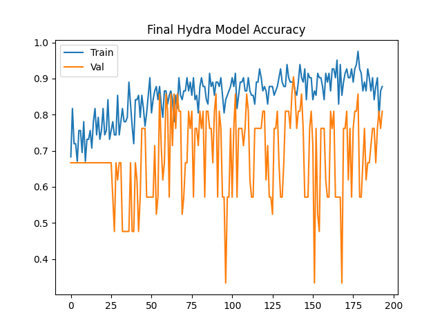
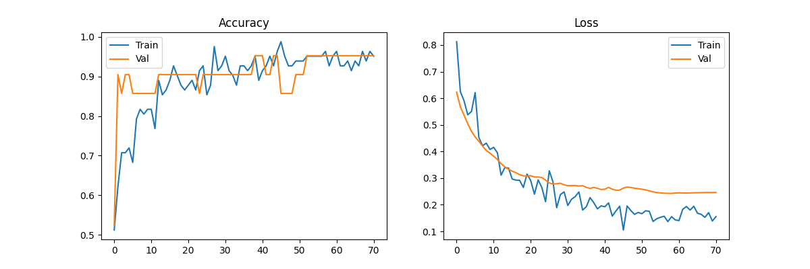
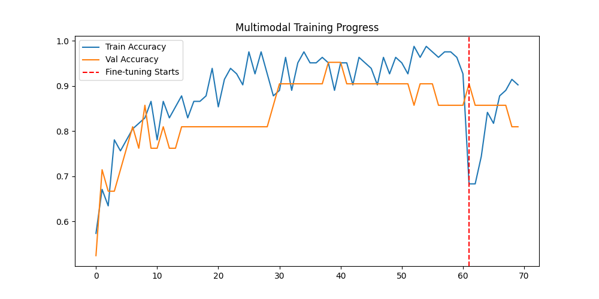
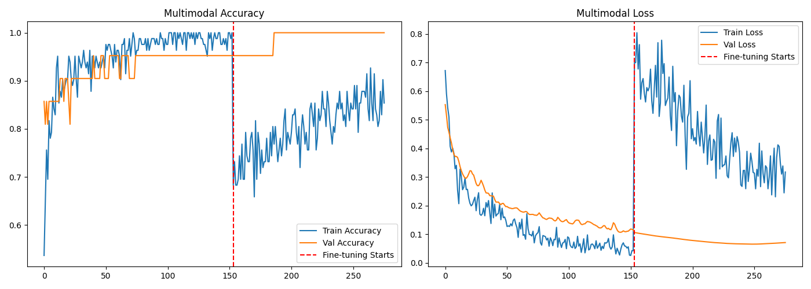

December 31, 2025:
While in transit, my computer's SSD was damaged, so it was replaced and I had to start over from the last commit. I now understand the importance of saving frequently.
I ran the model overnight. Training accuracy seems to be going up consistently, but the validation accuracy is all over the place. I am going to increase the batch size from 8 to 16, or 32 if needed, and see if this improves things.

January 1, 2026:

I added model checkpoints so now the model saves and I do not have to start from zero unless the model performs poorly. I also added class weights to try to fix the overfitting issue.

I’ve also added Label Smoothing, a much smaller Learning Rate, Dual-Branch Feature Learning, and Batch Normalization since previous attempts today were stalling. There’s no real point in showing a graph with no growth. We know what that looks like, and it is no help.

I ran it, and it plateaued at about 95% accuracy, which is very good; this is the ideal scenario. I am going to now try to add fine-tuning and run this overnight, but otherwise, this is good news.

January 2, 2026:

The fine-tuning tanks the training and validation accuracy, which is normal. However, early stopping prevents the fine-tuning to train well. I have upped the patience. 

After adjusting the patience and fixing the fine-tuning, it has reached 100% validation accuracy. Obviously this doesnt mean 100% accuracy in real world but its means pretty close. 
